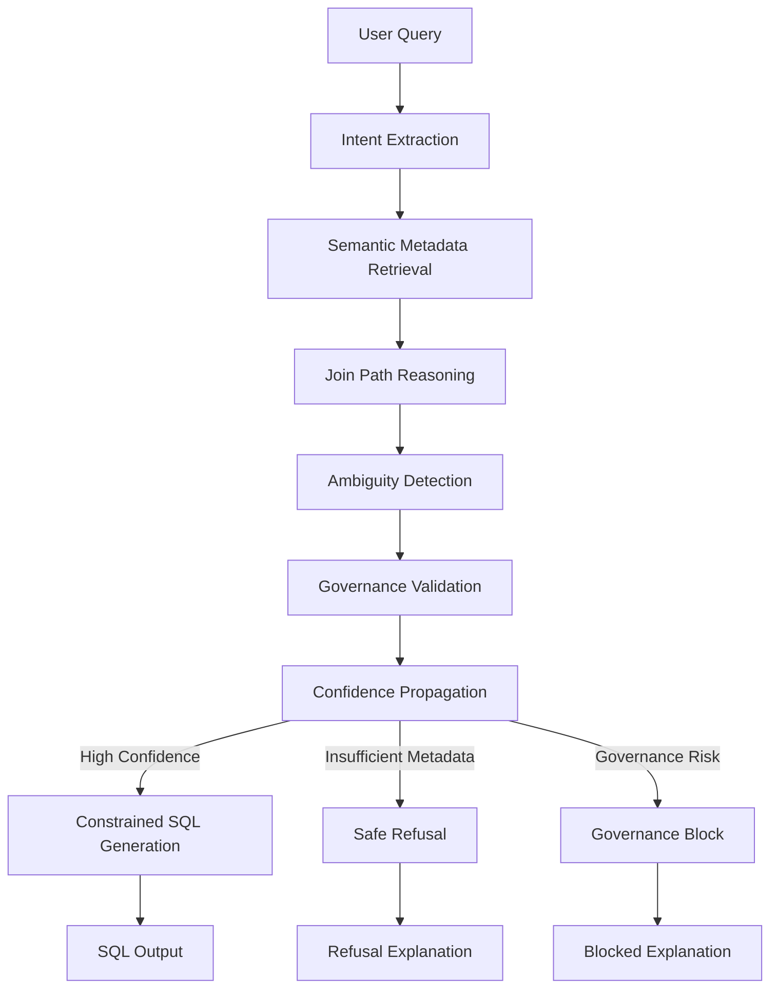
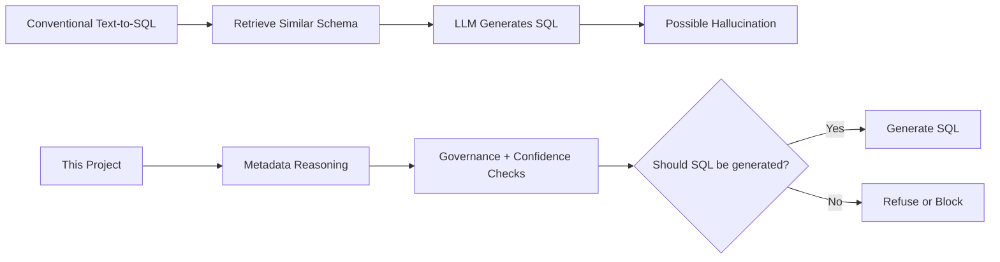

# Trust-Aware Metadata Reasoning


> A deterministic metadata reasoning system for **SQL generation**, **safe refusal**, and **governance blocking** — before calling an LLM.

This project focuses on trustworthy enterprise text-to-SQL orchestration using semantic metadata retrieval, governance-aware planning, confidence propagation, and explainable reasoning.

Unlike conventional RAG SQL systems, this platform separates metadata reasoning, semantic validation, governance enforcement, and confidence evaluation from final SQL generation.

> **This is a research-grade prototype, not a production database gateway.**

---

## Live Demo

Try the hosted demo:

**[https://trust-aware-metadata-intelligence.streamlit.app/](https://trust-aware-metadata-intelligence.streamlit.app/)**

*Add hero screenshot here.*

---

## Why This Exists

Most enterprise text-to-SQL systems fail because they:

- hallucinate columns
- invent joins
- ignore governance constraints
- silently choose ambiguous metrics
- generate unsafe queries

This project explores a different approach:

> **Deterministic metadata reasoning before LLM generation.**

The system evaluates semantic retrieval, join validity, governance constraints, ambiguity detection, and confidence propagation before deciding whether SQL generation is safe and semantically justified.

---

## Why Pure RAG Is Insufficient

Embedding similarity alone cannot reliably determine:

- valid join paths between tables
- metric ambiguity across business definitions
- governance safety for restricted models or PII columns
- warehouse cost risk from unsafe scan patterns
- semantic conflicts between overlapping terms

This system introduces deterministic metadata reasoning before SQL generation to constrain unsafe or ambiguous outputs — going beyond what retrieval similarity can provide.

---

## Core Capabilities

### Deterministic Query Planning

The system performs structured reasoning before SQL generation:

```
User Query
    ↓
Intent Extraction
    ↓
Metadata Retrieval
    ↓
Join Path Reasoning
    ↓
Governance Validation
    ↓
Confidence Propagation
    ↓
SQL Generation OR Safe Refusal
```

### Honest Refusal Behavior

Instead of hallucinating unsupported SQL, the system explicitly refuses queries when metadata is insufficient or ambiguous.

```
SAFE REFUSAL · Semantic Conflict

Multiple 'revenue' definitions found:
  - revenue_gross
  - revenue_net

Specify which definition is required.
```

### Governance-Aware Planning

The planner evaluates RBAC restrictions, PII exposure, unsafe scan patterns, and excessive warehouse cost risk before SQL execution.

```
GOVERNANCE BLOCK

Restricted model access detected:
  payment_events

Estimated Scan:
  18,000 GB
```

### Composite Retrieval Ranking

Metadata retrieval combines multiple enterprise-aware signals:

| Signal | Purpose |
|--------|---------|
| Semantic Similarity | Query relevance |
| Lineage Proximity | Upstream/downstream relationship strength |
| Glossary Overlap | Business terminology alignment |
| Historical Relevance | Prior analytical usage |
| Governance Compatibility | Policy-aware retrieval filtering |

Formula: `0.35 × Semantic + 0.25 × Lineage + 0.15 × Glossary + 0.15 × Historical + 0.10 × Governance`

### Confidence Propagation

Confidence is not treated as a single score. The system propagates confidence across retrieval quality, join reasoning, governance validation, metadata completeness, and intent clarity.

```
Retrieval            0.80  ████████░░
Join Path            1.00  ██████████
Governance           1.00  ██████████
Completeness         1.00  ██████████
Intent Clarity       1.00  ██████████
```

---

## Enterprise Reasoning Scenarios

### Semantic Metric Ambiguity

Enterprise warehouses often contain multiple competing business definitions for the same metric. When a query targets an ambiguous term, selecting one definition arbitrarily is a correctness failure — not a reasonable default.

```
show revenue by region
```

The system detects that `revenue` maps to multiple semantic definitions: `revenue_gross` and `revenue_net`. Instead of selecting one arbitrarily, the planner triggers a structured refusal and requests clarification before SQL generation proceeds.

### Governance-Constrained Planning

Analytical queries may target restricted models, expose PII columns, or trigger unsafe warehouse scan patterns. The governance layer evaluates all three dimensions before generation is approved.

```
show all payments
```

The governance layer detects restricted model access, potential PII exposure, and unbounded scan risk on `payment_events`. SQL generation is blocked before execution and a structured explanation is returned.

### Insufficient Metadata Grounding

When metadata entities cannot be confidently grounded in the knowledge graph, the planner refuses generation rather than hallucinating columns or fabricating join paths.

```
show me xyz_metric_zz99
```

No semantic metadata match exists in the graph. The planner returns `INSUFFICIENT_SCHEMA` with confidence `0.00` and a structured refusal explanation — no SQL is attempted.

### Confidence-Constrained SQL Generation

SQL generation is only approved when metadata retrieval succeeds, governance checks pass, join reasoning resolves cleanly, and confidence propagation exceeds the generation threshold across all components.

```
show segment data
```

The planner resolves the query to a single grounded metadata model (`dim_customer`) with no governance flags, no ambiguity, and a clean join path. Constrained SQL generation is approved at confidence `0.80`.

---

## Failure Taxonomy

The system recognises eight distinct failure types, evaluated in priority order:

| Failure Type | Trigger |
|---|---|
| `GOVERNANCE_BLOCKED` | Restricted model access, PII exposure, or unsafe scan pattern |
| `UNSAFE_QUERY` | Query matches known destructive or exfiltration patterns |
| `INSUFFICIENT_SCHEMA` | Required metadata entities not found in the graph |
| `WEAK_JOIN` | No valid join path exists between resolved tables |
| `SEMANTIC_CONFLICT` | Multiple conflicting metric definitions for the same term |
| `AMBIGUOUS_JOIN` | Multiple plausible join paths with no clear winner |
| `TEMPORAL_AMBIGUITY` | Time range or date filter cannot be resolved |
| `LOW_CONFIDENCE` | Confidence propagation falls below the generation threshold |

Each failure produces a structured explanation surfaced in the UI and included in evaluation metrics.

---

## Architecture



---

## Reasoning Philosophy

This project intentionally avoids:

- unconstrained agentic execution
- blind prompt-based SQL generation
- pure embedding retrieval
- opaque LLM-only orchestration

Instead, it focuses on:

- deterministic metadata planning
- constrained SQL generation
- explainable reasoning
- trustworthy refusal behavior
- governance-aware orchestration

---

## Repository Structure

```
Trust-Aware-Metadata-Intelligence/
│
├── ingestion/          # Manifest ingestor, lineage parser, graph store
├── reasoning/          # Query planner, entity extractor, confidence scorer
├── retrieval/          # Embedding ranker, glossary matcher, lineage scorer
├── generation/         # SQL generator, refusal engine
├── governance/         # PII detector, RBAC validator, cost estimator
├── explainability/     # Explanation formatter
├── evaluation/         # Benchmark runner and failure taxonomy tests
├── frontend/           # Streamlit reasoning demo
├── agents/             # Optional sequential orchestration layer
├── docs/               # Design references and architecture docs
└── tests/              # Full test suite (439 passing)
```

---

## Evaluation

Current synthetic benchmark baseline:

| Metric | Score |
|--------|-------|
| Overall Accuracy | 0.73 |
| Refusal Precision | 0.74 |
| Refusal Recall | 0.97 |
| Failure-Type F1 | 0.84 |
| Ambiguity Accuracy | 0.92 |
| Hallucination Accuracy | 0.88 |
| Governance Recall | 1.00 |
| Unsafe Recall | 1.00 |

**439 tests passing** across ingestion, reasoning, retrieval, governance, generation, explainability, and evaluation modules.

> The benchmark suite intentionally prioritizes trustworthy refusal behavior and governance enforcement over unconstrained SQL generation — which explains the strong Refusal Recall and Governance Recall scores relative to Overall Accuracy.

---

## Demo

The project includes a single-page Streamlit reasoning demo that shows SQL generation, safe refusal behavior, governance blocking, confidence propagation, metadata grounding, and join reasoning — without exposing raw orchestration complexity.

```bash
streamlit run app.py
```

---

## Screenshots

**Safe SQL Generation**

*Add screenshot here.*

**Semantic Conflict Refusal**

*Add screenshot here.*

**Governance Blocking**

*Add screenshot here.*

---

## Running Locally

### Install

```bash
pip install -r requirements.txt
```

### Start Demo

```bash
streamlit run app.py
```

### Run Tests

```bash
pytest -q
```

---

## Research Direction

This project explores how enterprise text-to-SQL systems can become more trustworthy through:

- deterministic metadata reasoning
- semantic ambiguity detection
- governance-aware planning
- confidence-aware orchestration
- constrained SQL generation

Future directions include dbt manifest ingestion, enterprise lineage reasoning, semantic join inference, and warehouse observability integration.

---

## Key Differentiator

Most text-to-SQL systems ask:

> *Can the LLM generate SQL?*

This project asks:

> **Should the system generate SQL at all?**

That distinction is the foundation of this architecture.



---

## License

MIT License
